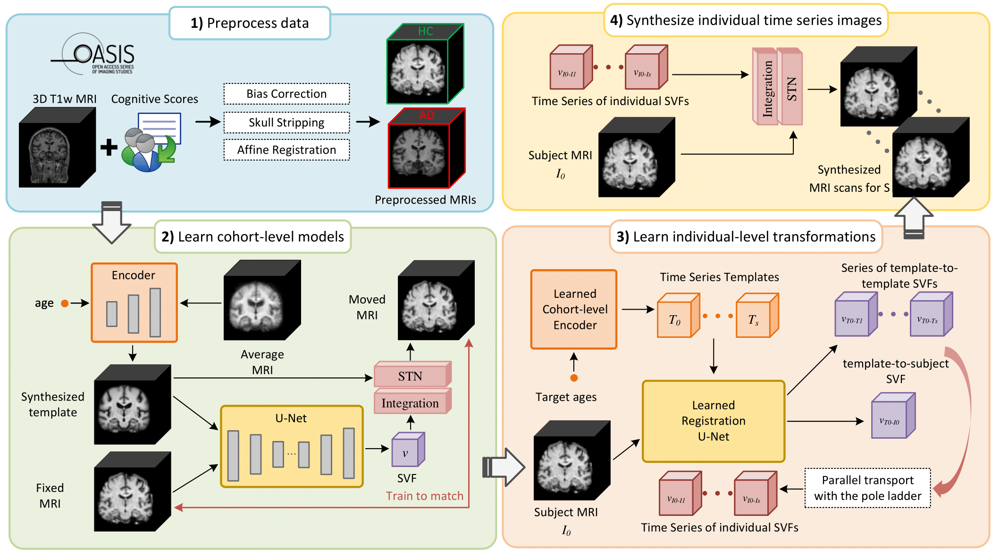

# InBrainSyn



This repository contains the source code for the research paper titled "*Synthesizing Individualized Aging Brains in Health and Disease with Generative Models and Parallel Transport*". You can find the paper [here](https://www.sciencedirect.com/science/article/pii/S1361841525002166). ([arXiv](https://arxiv.org/abs/2502.21049))

---

> **Note**  
> 🚀 The Docker image for running Pole Ladder is now available on Docker Hub!

---

## Table of Contents
- [OASIS-3 Dataset](#oasis-3-dataset)
- [Pre-trained Template Creation Models](#pre-trained-template-creation-models)
- [Instructions](#instructions)
  - [Quick Setup](#quick-setup)
  - [Run Pole Ladder](#run-pole-ladder)
- [Citation](#citation)
- [Acknowledgements](#acknowledgements)

---

## OASIS-3 Dataset

To use this dataset (including the examples in this repository), please cite the following and adhere to the [Data Use Agreement](https://www.oasis-brains.org/#access):

> Pamela J LaMontagne et al., "OASIS-3: Longitudinal Neuroimaging, Clinical, and Cognitive Dataset for Normal Aging and Alzheimer Disease," *medRxiv* (2019). DOI: [10.1101/2019.12.13.19014902](https://doi.org/10.1101/2019.12.13.19014902).

---

## Pre-trained Template Creation Models

Pre-trained [Atlas-GAN](https://github.com/neel-dey/Atlas-GAN) weights are available [here](https://github.com/Fjr9516/InBrainSyn/releases/tag/v1.0.0). Download and place them in the appropriate directory.

---

## Instructions

### Pipeline Overview:
The pipeline is demonstrated in `InBrainSyn.py` using a subject from the OASIS-3 dataset. Parallel transport is performed using Pole Ladder. Follow the steps below for proper execution:

0. Download Pre-trained Weights: [Download weights](https://github.com/Fjr9516/InBrainSyn/releases/tag/v1.0.0) and place them in the directory: `./models/`.
1. **Run Step 1**: Extract the SVF and prepare the data for running Pole Ladder.
   ```bash
   python InBrainSyn.py --step 1 --is_half --single_cohort HC
   ```
2. **Run Step 2 Pole Ladder**: Follow the instructions in the corresponding section of the documentation.
3. **Run Step 3**: Apply the transported SVF and generate the final outputs.
   ```bash
   python InBrainSyn.py --step 3 --is_half --single_cohort HC
   ```

### Quick Setup
To set up the environment for running `InBrainSyn` step 1 and 3:

#### Option 1: Using Conda
```bash
# Create a Conda environment
conda create -n tf_gpu_2.5 python=3.8 -y

# Activate the environment
conda activate tf_gpu_2.5

# Install required packages
pip install tensorflow-gpu==2.5.0 voxelmorph matplotlib==3.4.3 nibabel==3.2.1 scikit-image==0.18.3 scipy==1.5.4 pandas==1.2.3 numpy==1.19.5 tensorflow-addons==0.13.0
conda install cudatoolkit=11.2 cudnn=8.1 simpleitk jupyterlab -c conda-forge

# Verify installation
python -c "import tensorflow as tf; print('TensorFlow version:', tf.__version__)"
python -c "import voxelmorph as vxm; print('VoxelMorph version:', vxm.__version__)"
```
#### Option 2: Using Apptainer
Tested on [Alvis](https://www.c3se.chalmers.se/about/Alvis/):

1. Remove All Modules:
   ```bash
   ml purge
   ```

2. Install Packages:
   Ensure you’ve created the required directories in `InBrainSyn_setup_Apptainer.sh`, then run:
   ```bash
   ./InBrainSyn_setup_Apptainer.sh pip install --user voxelmorph matplotlib==3.4.3 \
            nibabel==3.2.1 scikit-image==0.18.3 scipy==1.5.4 pandas==1.2.3 \
            numpy==1.19.5 tensorflow-addons==0.13.0 simpleitk jupyterlab
   ```

3. Validate Installation (Optional):
   ```bash
   ./InBrainSyn_setup_Apptainer.sh python -c "import tensorflow as tf; print('TensorFlow version:', tf.__version__)"
   ./InBrainSyn_setup_Apptainer.sh python -c "import voxelmorph as vxm; print('VoxelMorph version:', vxm.__version__)"
   ./InBrainSyn_setup_Apptainer.sh python -c "import tensorflow as tf; print('GPUs:', tf.config.list_physical_devices('GPU'))"
   ```

---

### Run Pole Ladder

#### Option 1: Build the Docker Image

1. Download the necessary resources:
    - Download [Pole ladder](http://www-sop.inria.fr/teams/asclepios/software/LCClogDemons/Ladder.tar.gz) 
    - Download cmake (I used [cmake-3.17.3](https://cmake.org/files/v3.17/))

2. Unzip them in the same folder to successfully build the Docker image. 

3. Build the Docker image using the provided in `./Dockerfiles`.

#### Option 2: Use the Pre-built Docker Image
Alternatively, you can pull the pre-built Docker image from Docker Hub:

```bash
# Pull the pre-built Docker image
docker pull jrfu/pole_ladder:latest

# Start a container
docker run -it --rm -v "$(pwd)/examples/shared_volume/:/usr/src/myapp/volume/" --name c1_ladder jrfu/pole_ladder:latest
```

Once the container is running, copy the file `step2_parallel_transport_using_SchildsLadder_example.sh` to `./examples/shared_volume/`. The compiled executable for the algorithm is located at `/usr/src/myapp/Ladder/Ladder/build/`

#### Option 3: Using Singularity
Tested on [Alvis](https://www.c3se.chalmers.se/about/Alvis/):

1. Pull the image from Docker Hub and convert it to a Singularity image:
   ```bash
   singularity pull /your/path/to/pole_ladder_latest.sif docker://jrfu/pole_ladder:latest
   ```

2. Run the script `step2_parallel_transport_using_SchildsLadder_example_sif.sh` with Singularity.

## Citation
```
@article{fu2025synthesizing,
  title = {Synthesizing individualized aging brains in health and disease with generative models and parallel transport},
  author = {Fu, Jingru and Zheng, Yuqi and Dey, Neel and Ferreira, Daniel and Moreno, Rodrigo},
  journal = {Medical Image Analysis},
  pages = {103669},
  year = {2025},
  issn = {1361-8415},
  doi = {10.1016/j.media.2025.103669},
  url = {https://www.sciencedirect.com/science/article/pii/S1361841525002166}
}
```

## Acknowledgements:
This repository is developed based on the [Atlas-GAN](https://github.com/neel-dey/Atlas-GAN) project and makes extensive use of the [VoxelMorph](https://github.com/voxelmorph/voxelmorph) library. [SynthSeg](https://github.com/BBillot/SynthSeg) version 2.0 is used to get segmentation masks. 

